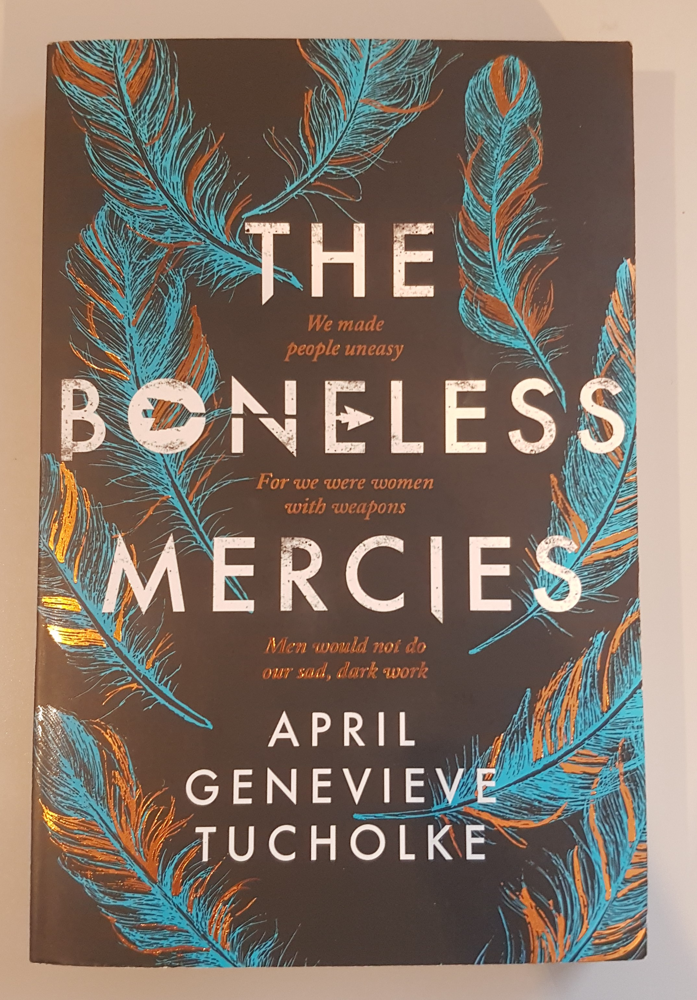

We all know the old saying 'don't judge a book by its cover'. And while it generally means we shouldn't judge people purely based on their physical appearance, it is exactly what we do with actual books. The cover is the first thing we usually see when we pick up a book, if not the spine. It therefore needs to be compelling enough for readers to want to read the blurb and then maybe buy the book. But how exactly can a cover achieve this?

Firstly, the cover needs to be aesthetically pleasing, in terms of colour palette. Think about complementary colours (i.e. colours on the opposite ends of the colour wheel, such as red and green, or blue and orange), or gradients of colours that work together (such as red, orange, and yellow), or even a monochromatic cover with different tones of a same colour. Working on the aesthetic of the cover also means thinking in terms of fonts and shapes. A cover too crowded will likely confuse the potential reader, while an overly simplistic one runs the risks of being underwhelming and equally confusing as an overcrowded one (this is especially true for fiction books, non-fiction books like cookery books generally benefit from a simple cover). The cover also needs to give readers some clues as to what the story is about, or at least, about the characters. However, the cover shouldn't be giving away too much information, as going in more depth is the role of the blurb.

Because things are always clearer when you provide an example, I will now talk about one of my favourite book covers. The book is *The Boneless Mercies* by April Genevieve Tucholke, published in 2018 by Simon & Schuster (see image above). The book tells the tale of four women who are Boneless Mercies, or 'death-traders'. The cover appears simple at first, with feathers on the sides of the page, but it gets more complex when you analyse it. First of all, the placement of the words; they are all centred, with the feathers surrounding them, which gives a harmonious and controlled look to the cover. The fonts stay simple, and more work is put into the colours used. The title is written in white, but a dark grey colour is splattered here and there, giving the impression of ash or footprints in the snow (giving details as to where some of the story is taking place). An arrow crosses the letters O, N, and E in *Boneless*, which is extremely clever, because it can be read on three different levels:

\- the four protagonists have no family, effectively being alone,

\- they are extremely close to each other, to the point where they became one family,

\- they are the only Boneless Mercies left.

A quote is written in copper foliage between the words of the title, and the same copper is found mixed with blue in the feathers. While the blue is more present in the feathers, the copper enhances them, by giving them more depth. The choice of putting feathers on the cover is also clever, since the cloaks the main characters wear are made of feathers.

Overall this cover is beautifully designed and while some deductions about the details can be made before reading the book, some details only make sense after having read it, which in my opinion, makes it all the more interesting.