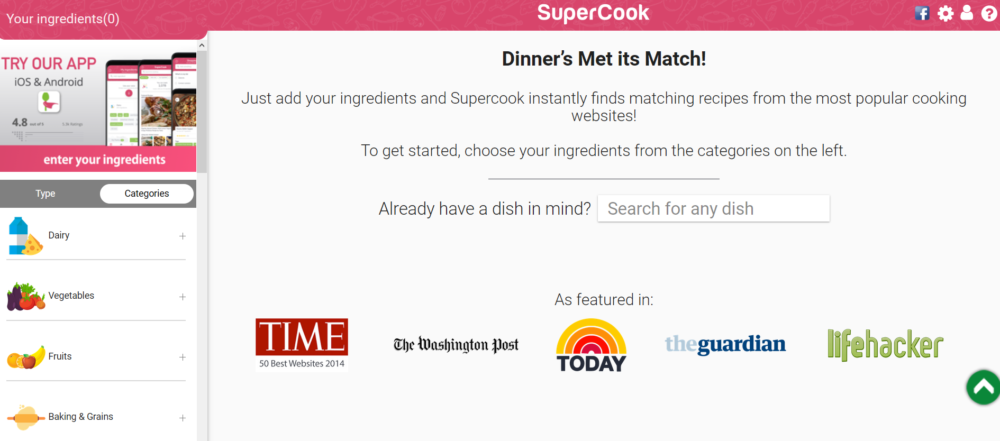

Before internet took over our life (which, said like that, sounds way scarier than it actually is), people either used cookbooks or family recipes to cook. Nowadays, in the era commonly known as 'the digital age', we have a plethora of options when it comes to finding inspiration for recipes.

Cookbooks are still insanely popular, even more so because of (or thanks to) the COVID-19 pandemic, where people have tried to be more experimental in the kitchen, to make up for the fact that restaurants were closed (and to try and get rid of boredom). Brian Amick, who wrote an article for *Bakemag* on 28 October 2020, argued that 'the NPD Group finds that 200,000 more bread cookbooks have been sold in the US in 2020 than were in 2019'. It is not difficult to assume that the same assessment can be made for other countries like France or the UK. However, cookbooks have a lot of competition coming from websites and apps, or other services such as recipe boxes.

Looking at the former first, websites are now a good way to find recipes on the go. Some websites such as *Epicurious* allow you to look up a particular recipe, while other websites like *Supercook* ask you to add the ingredients you have at your disposal, before finding matching recipes.

The website *Escoffieronline* has an article written in 2019 about cooking apps that allow you to find recipes for ingredients you already have. Amongst them, we can find *Allrecipes*, an app that allows people to not only include ingredients in the recipes they're looking for, but also to exclude them if they have particular allergies or just don't have the ingredient at their disposal. *Cookpad* is another app, which serves as both a cookbook and a social media platform, by allowing users to share recipes they have invented and gain followers. The article mentions other websites and apps, such as *My Fridge Food* and *Tasty*.

Lastly, we have seen over the past years the development of recipe boxes. The blog *JoAnn's Food Bites* has an article where the author talks about such companies, like *Hello Fresh* and *Gousto*. These companies allow you to sign up for a specific number of meals, and they then send you a box with the recipe as well as all the necessary ingredients. And it's not even that expensive! *Hello Fresh*'s deals start from £3.25 per meal and person, and they usually have discount codes and partnerships with other subscription boxes.

The digital age allows us to find recipes pretty much everywhere and anywhere, so whether you like the texture of pages on your fingertips or prefer scrolling on your phone or computer, you *will* find the recipe that makes your stomach happy.

 

**Sources:**

Amick, B. (2020) 'Coronavirus pandemic leads to rise in cookbook sales', *Bakemag*, 28 October. Available at: <https://www.bakemag.com/articles/13983-coronavirus-pandemic-leads-to-rise-in-cookbook-sales>

Epicurious's website, available at: <https://www.epicurious.com/>

Hello Fresh's website, available at: <https://www.hellofresh.co.uk/>

No name (2019) 'Top Apps For Finding Recipes For Ingredients You Already Have', *Escoffieronline*, 20 February. Available at: <https://www.escoffieronline.com/top-apps-for-finding-recipes-for-ingredients-you-already-have/>

Supercook's website, available at: <https://www.supercook.com/#/recipes>