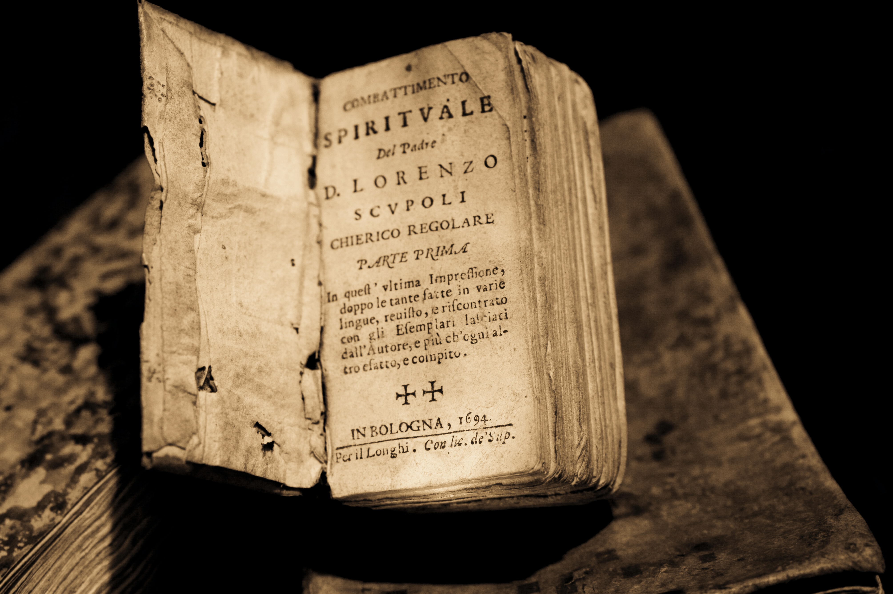

The cover is one of – if not the – most essential feature of a book. Indeed, it is the first thing potential buyers see when they pick up a book. While book covers are as diverse as the shape of snowflakes, they all display the same information: the title of the book, the name of the author, a picture, and maybe the publisher/imprint. However, this is the modern type of book cover, and as this article will show, they did not always look like that.

Before the printing press was invented (i.e., before 1450), books were literal works of art. They were almost exclusively sacred texts and were all handwritten. The covers were usually made of leather and had all kind of ornaments, from precious stones and ivory to embroidery and threads. At this time, books were not made to be packed in a bag and travel with people, they were instead strongly protected and only available for consultation by a select few, mainly scholars.

The invention of the printing press by Gutenberg allowed for books to be printed, meaning it took less time to actually make them, but also that more could be made. While covers were still made of leather, they had less ornaments.

The title page appeared in the 16th century, with the same information we now see on book covers: the title, the name of the author, etc. Customers actually bought their books uncovered, and then could go to a specialist, who would bind the cover to the book according to the customer's desires. This changed in 1820, where printers started including the cover of the book in the printing process itself. Ten years later, in 1830, the first jacket was created, at the time called 'removable cover', which was great when people wanted to offer books to their friends or family.

Covers started being more colourful around 1860, and at the end of the 19th century, fabric had completely replaced leather. Embossed illustrations were also very popular.

The late 19th/early 20th centuries also marked the beginning of illustrated covers (not embossed), with the Yellow Book (a quarterly British magazine), and in the 1930s, the paper jacket replaced the fabric binding, notably for economic reasons.

In 1935, Penguin revolutionised the book market with their cheap and recognisable paperbacks. Each genre had its specific colour (orange for fiction, blue for biography, etc.), and they acted as the precursor for the covers we have nowadays. Penguin was king in the UK, but in France, Gallimard and their 'white' editions had taken over the market. However, both styles remained simple, and only the necessary information were featured on the covers.

This changed in the 1950s where covers started resembling the ones we have now, with more colourful illustrations, and it evolved even more in the 1990s/2000s, as technology became more and more efficient, allowing publishers to be even more creative when it came to book covers.

**Sources:**

Guillermou, T. (2017) 'A short history of book covers 1/4)', *Graphéine*, 14 June. Available at:  <https://www.grapheine.com/en/history-of-graphic-design/history-of-book-covers-1> 

Guillermou, T. (2017) 'A short history of book covers 2/4)', *Graphéine*, 29 June. Available at:  <https://www.grapheine.com/en/history-of-graphic-design/history-of-book-covers-2> 

Guillermou, T. (2017) 'A short history of book covers 3/4)', *Graphéine*, 12 July. Available at:  <https://www.grapheine.com/en/history-of-graphic-design/history-of-book-covers-3> 

Guillermou, T. (2017) 'A short history of book covers 4/4)', *Graphéine*, 31 August. Available at:  <https://www.grapheine.com/en/history-of-graphic-design/history-of-book-covers-4>