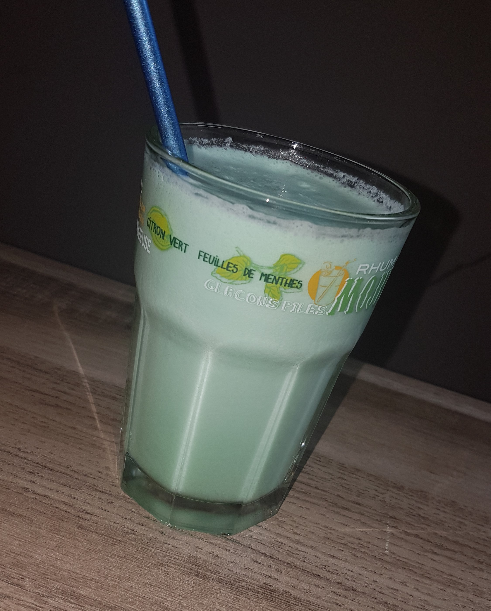

This smooth, fancy cocktail will transport you into a realm of wonders and excitement. While this recipe uses coconut milk, you can use coconut cream instead to have a thicker consistency.

Serves: 1

Preparation time: 5 minutes

## Ingredients

* 4cl of white rum
* 2cl of blue curaçao
* 8cl of pineapple juice
* 4cl of coconut milk
* 1 slice of pineapple (optional)

## Method

1. Put all the ingredients in a cocktail shaker.
2. Add ice in the cocktail shaker and shake vigorously.
3. Pour the drink in a tall glass.
4. Add a slice of pineapple on the edge of the glass (optional).