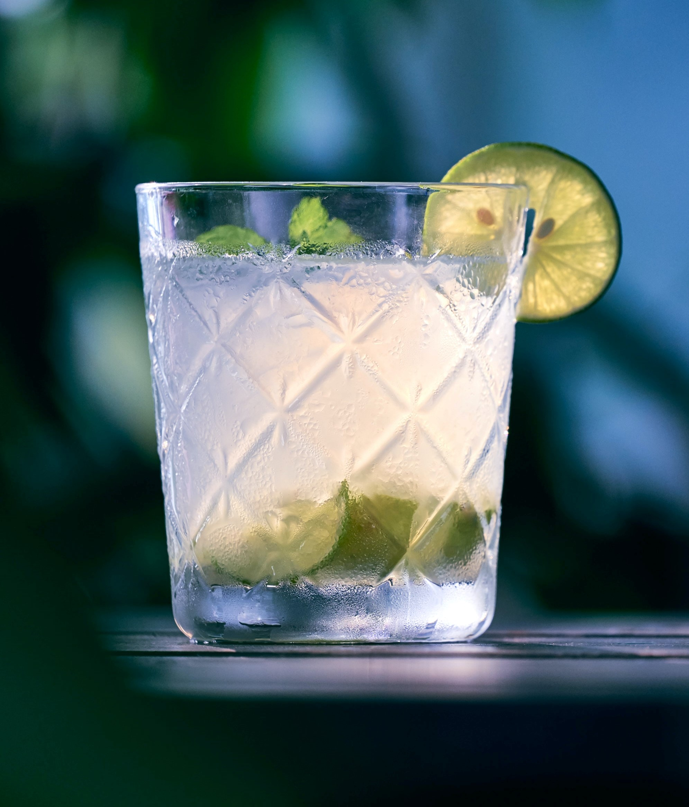

Especially popular in French-speaking Caribbean isles like Guadeloupe, Ti'punch means 'little punch', and is often consumed as an aperitif. Very easy to make, it requires little to no ingredient. 

Serves: 1

Preparation time: 5 minutes

## Ingredients

* 30ml of white cane sugar syrup (you can use brown sugar as a replacement)
* 90ml of white rum
* ¼ of whole lime
* A few slices of lime (unpeeled), for serving (optional)

## Method

1. Pour the white rum and the cane sugar syrup directly into the glass.
2. Squeeze the lime into the glass to get the juice out (then put the lime in the glass).
3. Stir with a cocktail spoon.
4. Add ice (optional).
5. Add 2 to 3 slices of lime to the rim of the glass (optional).