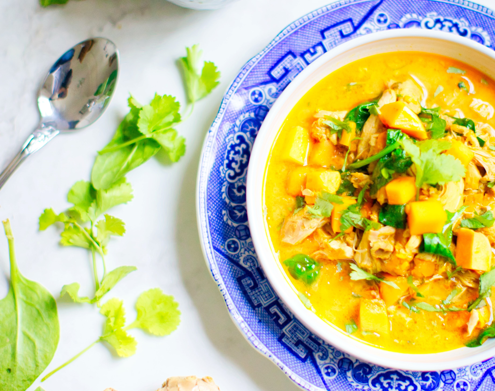

Colombo, just like curry, isn't actually one spice, but the combination of several spices, in this case, coriander, cumin, yellow mustard seeds, fenugreek, fennel, pepper, turmeric and allspice, in equal measure. While you can buy Colombo already made, you can also do it yourself, which is often more satisfying. (Note that some of those spices can be found in curry, so you can use that as well)

Serves: 6

Preparation time: 40 minutes

Cooking time: 1h15

## Ingredients

* 1 chicken (about 1.8kg), skin removed and cut into small pieces
* 45ml of olive oil
* 1 red onion, thinly sliced
* 6 garlic cloves, peeled and halved
* 1tsp of crushed red pepper (or to taste)
* 1tsp of chopped chili pepper (or to taste)
* 2tbsp of ground Colombo powder
* 3 small potatoes, peeled and cut into quarters
* 1 sweet potato, peeled and cubed
* 1 zucchini, cubbed
* 2 green onions, chopped
* 1 can (approx 400ml) of coconut milk 
* Juice of 1 lime
* Salt and pepper

## Method

1. In a large pot, brown the chicken in the oil. Season with salt and pepper and set aside on a plate.
2. In the same pot, soften the onion and garlic with the pepper and Colombo powder. Add oil, if needed. Return the chicken to the pot and add the vegetables, coconut milk and lime juice. Season with salt and pepper.
3. Cover and simmer for about 45 minutes, stirring occasionally. Remove the lid and cook for about 15 minutes longer or until the meat pulls away from the bone. Adjust the seasoning.
4. Serve with steamed rice.