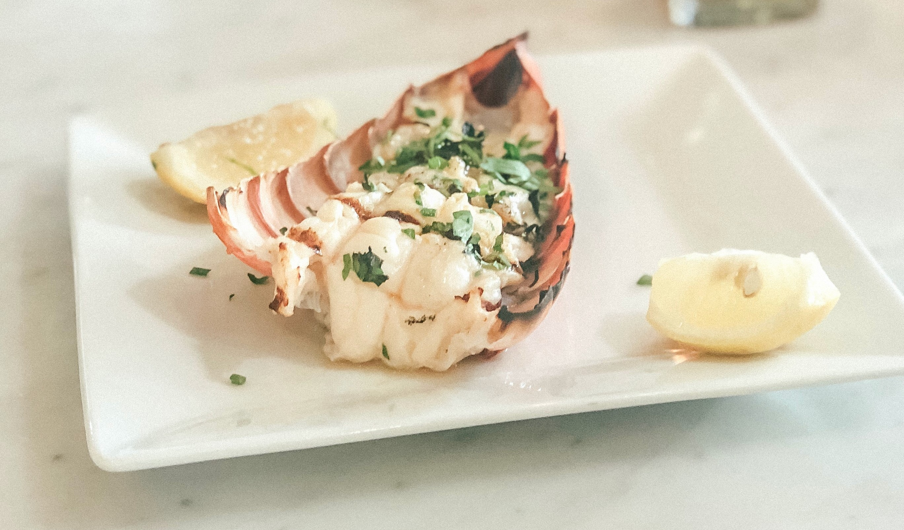

If lobster is expensive in Europe, it is way cheaper in the Caribbeans (17 euros for 1 kg of fresh (alive) lobsters, compared to 120 euros in France), meaning people actually eat it more often, and have developped several recipes for it. This recipe is the easiest and simplest one, and while it uses a roasting tray, you can also cook your lobster tails on the barbecue.

Serves: 4

Preparation time: 20 minutes

Cooking time: 10 minutes

## Ingredients

* 4 lobster tails, defrosted if frozen
* lemon wedges, to serve

### For the butter

* 125g of butter, softened
* 1 garlic clove, crushed
* a handful of parsley leaves, finely chopped, plus extra to serve
* 1 tsp of mustard
* a small pinch of chili powder (optional)
* 1 lemon, juiced

## Method

1. Make the butter by mixing together all the ingredients, then season and set aside. *(Can be made two days ahead. Remove from the fridge to soften before using).*
2. Use kitchen scissors to cut along the tops of the lobster shells, then flip the tails over and crack the ribs of the shell. Use your fingers to open the shell and loosen the meat keeping it attached at the base and pull it half out. Use a knife to cut along the top of the tail without cutting all the way through and remove the vein if you see one. Sit the tail in a shallow roasting tray and add some butter to each one. (*Tails can be prepared a few hours ahead and chilled).*  
3. Heat the grill to high, then grill the lobster tails for 10 mins until cooked through. Put them on plates and drizzle with the butter from the pan, or pour the butter into a ramekin and put it in the middle of the table for dipping the lobster meat in. 
4. Serve with lemon wedges and scatter with extra parsley (optional).
5. You can serve the tails with basmati rice with spices in it.