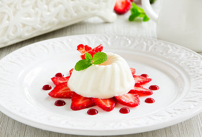

While blancmange isn't a Creole dish (its origins are most likely in Persia during the Middle Ages), it's one of (if not the) most famous Caribbean dessert. 

Serves: 6

Preparation time: 15 minutes

Cooking time: 5 minutes

## Ingredients

* 500ml of coconut milk
* 420ml of condensed milk
* 50g of fresh coconut, finely grated
* Zest of 2 organic limes
* 1 pinch of ground cinnamon
* 1 tbsp of rum
* 1 pinch of salt
* 1 vanilla pod, cut lengthwise and scraped
* 2,5g of agar (or 6 gelatin sheets), softened in a bowl of cold water

## Method

1. In a large non-stick pan, pour the coconut milk, grated coconut and sweetened condensed milk.
2. Add the cinnamon, vanilla seeds, salt and the zest of limes.
3. Stir in constantly and bring to a simmer over medium heat.
4. Add rum.
5. Off the heat, add the agar or squeezed gelatin.
6. Whisk until dissolved.
7. Pour into a greased large mold with patterns or in individual ramekins.
8. Allow to cool before putting the blancmange in the refrigerator for at least 6 hours.
9. Serve plain or with a tropical fruits coulis.