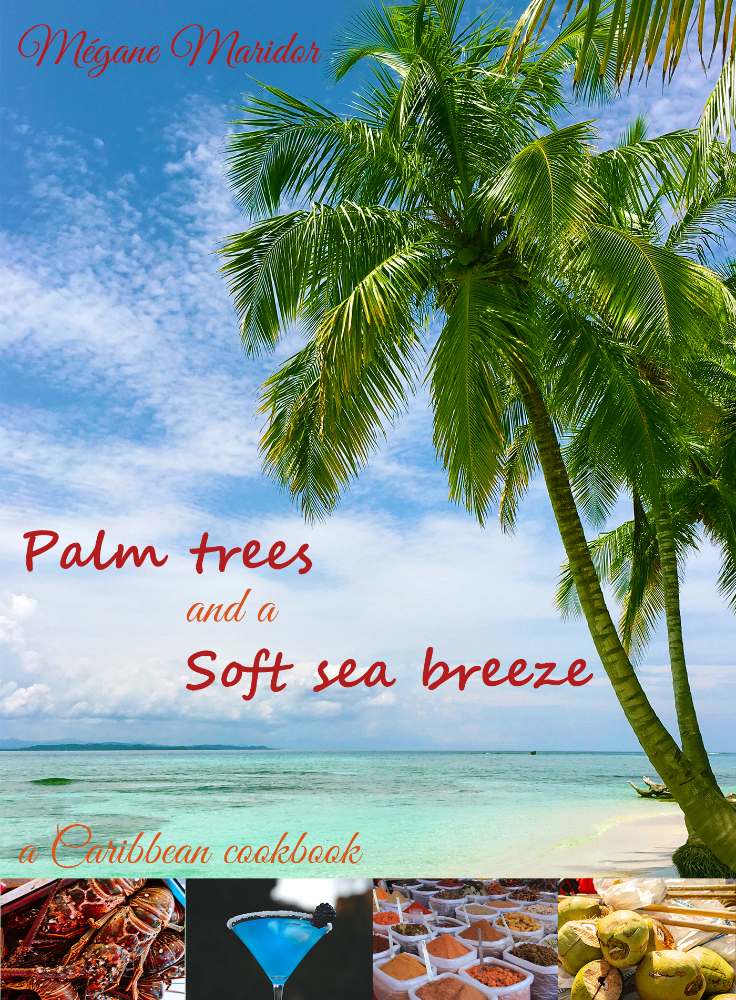

Have you ever wished you could be lying down under a palm tree, a cocktail in hand and the shimmery sea in front of you? While this cookbook is no match compared to a plane ticket for the Bahamas, it takes you on a gustatory journey to make you forget about your small under-heated apartment, even for just a moment.

With its beautifully designed pages and mouth-watering images, this cookbook guides you through the preparation of several Caribbean dishes, from entries to desserts, and of course, colourful cocktails (please note these are never complete without those small paper parasols children love so much). Be prepared to add spices in your life, as well as make your friends wonder if you did take an impromptu trip to Cuba behind their backs!

